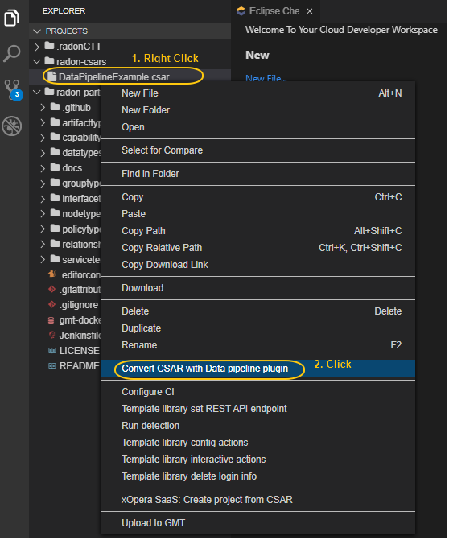
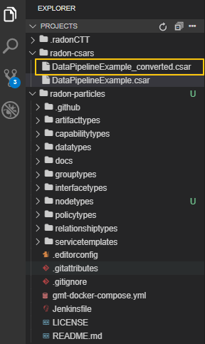

User Guide
***********
In this section, you will see how to design a service template using data pipeline nodes. With the current version of TOSCA based data pipeline node types, user can not create a connection with other non-data pipeline TOSCA nodes. The TOSCA data pipeline nodes can be found in `RADON particle <https://github.com/radon-h2020/radon-particles>`_ GitHub repository.

To illustrate the design process, let consider an use case of synchronising AWS S3 bucket and Google Cloud Storage (GCS) bucket.

Demo Video
----------
Users can user RADON IDE, to design a service template in data pipeline apparoche.
In this example, we will create a service template that syncronises Amazon S3 bucket and Google Cloud Storage (GCS) bucket.

The following video provides a 5-minute demo on how to design the service template using RADON IDE.

.. raw:: html

   <iframe src="https://drive.google.com/file/d/1DL5mqEIK8qs1REuuKqNViKGGSEq_jJzH/preview" width="640" height="480"></iframe>

Steps:

1. Login to RADON IDE (`How to <https://radon-ide.readthedocs.io/en/latest/#access-to-the-radon-ide>`_)
2. Create and Go to your workspace (`How to <https://radon-ide.readthedocs.io/en/latest/#create-a-radon-workspace>`_)
3. Launch the Graphical modelling tool to create a service template (`How to <https://radon-ide.readthedocs.io/en/latest/#how-to-launch-radon-tools>`_)
4. Create the service template (`How to <https://winery.readthedocs.io/en/latest/user/yml/index.html#modeling-an-application>`_)
5. Go to the topology modeller by clicking on `*Topology Template*
6. Form the *Palette* area, create following node types
    `OpenStack` node which is under `radon.nodes.VM`
    `Nifi` TOSCA node from `radon.nodes.nifi`
    `ConsS3Bucket` TOSCA node from `radon.nodes.datapipeline.source`
    `PubGCS` TOSCA node from `radon.nodes.datapipeline.destination`
7. Host `Nifi` on `OpenStack`.
8. Similarly, host `ConsS3Bucket` and `PubGCS` on `Nifi`
9. Connect `ConsS3Bucket` to `PubGCS`. 
10. Save the service template and close the window.
11. Now, in the `Winery Repository` window, export the service template to IDE and close the window.

How to use Data pipeline plugin from RADON IDE
----------
The data pipeline plugin can be used to ensure the consistency in the data pipeline-based TOSCA service template. The plugin takes the CSAR as the input and returns the modified CSAR which can be used further with other RADON tools, such as orchestrator, VT, etc. The plugin checks mainly two types of potential user-made errors. Firstly, the errors related to the connection between two data pipeline nodes. Here, the plugin checks if two pipeline nodes are connected with the correct relationship type. This also checks if multiple connections exist between any pair of pipeline nodes. Secondly, the plugin also updates the CSAR with correct configuration if it found any improper encryption configuration.

   Figure IDE_DPP.1: Option to invoke data pipeline plugin    

To invoke the data pipeline plugin with exported CSAR (in this case `DataPipelineExample.csar`), right click on the csar and select “Convert CSAR with Data pipeline plugin” option, as shown in  Figure IDE_DPP.1. The converted csar will be exported to the same folder structure, in this case the output is `DataPipelineExample_converted.csar`, as shown in Figure IDE_DPP.2.

   Figure IDE_DPP.2. Data pipeline plugin output    
