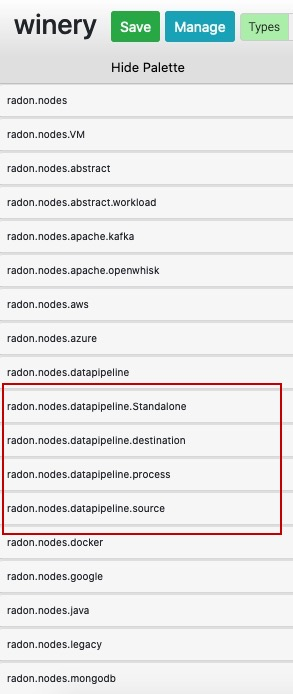
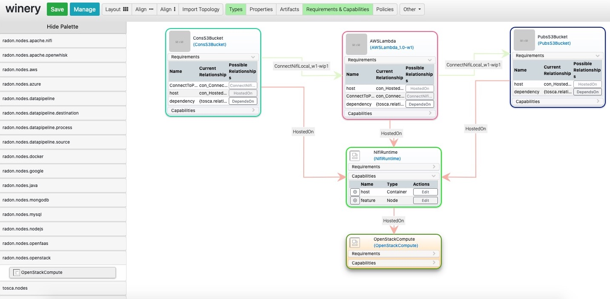

Generating Pipeline CSAR
~~~~~~~~~~~~~~~~~~~~~~~~~

The TOSCA based data pipeline service tempalte can be generated usng the RADON Graphical Modelling Tool (GMT), Winery. 
You can follow this step to setup RADON GMT. 

* Open Winery and click on *Service Templates* manu.
* Create a new srvice tempalte by clicking on *Add New* button. 
* Provide suitable name and click on *Add* button.
* Here you can see the list of service templates. Select newly created service template.
* Now select the *Topology Template* menu item followed by *Open Editor* button.
* In the *Winery: topology modeler* window, find the suitable data pipeline TOSCA nodes.
* Drag the required TOSCA nodes from the palette area (as shown in below figure) and set the properties and make the connection with other pipeline nodes. All the pipeline related nodes fall under the highighted categories in below figure.

* An example for such is given can be seen in following figure:

The figure contain three pipelines: ConsS3Bucket, AWSLmabda, and PubsS3Bucket. These three pipelines are hosted atop Nifi environment within OpenStack private cloud environment. 

* Click on the *Save* button and close the Topology modeler window.

* Now in the *Winery Repository* window, export the CSAR file, by clicking on *Export* -> *Download*.
you may refer to `Winery User Guide  <https://eclipse-winery.readthedocs.io/en/latest/>`_ for further instruction on how to export the CSAR. 

The exported CSAR now can be sent to data pipeline plugin.

Verifying and updating with data pipeline Plugin
~~~~~~~~~~~~~~~~~~~~~~~~~~~~~~~~~~~~~~~~~~~~~~~~

The plugin can be used through command line interface or by invoking the REST API using Swagger UI. 

How to use the plugin CLI?
*********************************************

- Download the plugin github repository using git or as a zip file. 
- Make sure that Python3 environment is working on your machine.
- Keep your TOSCA service ready and note the path. 
- Keep the CSAR file ready for input. 
- Install the opera in virtual environment
:: 

  $ mkdir ~/opera && cd ~/opera
  $ python3 -m venv .venv && . .venv/bin/activate
  (.venv) $ pip install opera

[click here](https://pypi.org/project/opera/0.5.8/) for detailed installation procedure of Opera.
It is recommended to install opera v0.5.8.

- install ruamel.yaml
:: 

  (.venv) $ pip install ruamel.yaml

- Change current directory to `/src`.
- Execute the following command with the CSAR file 
:: 

  (.venv) $ python3 DPP.py <.csar file>

- A sample `input <https://github.com/radon-h2020/radon-datapipeline-plugin/blob/master/original-sample.yml>`_  and `output <https://github.com/radon-h2020/radon-datapipeline-plugin/blob/master/output-sample.yml>`_ YAML file can be found `here <https://github.com/radon-h2020/radon-datapipeline-plugin>`_.

How to use the plugin API?
*******************************************

The plugin also contains a REST-based interface, using which users can execute the plugin on-demand or include it as a part of a CI/CD process. DataPipeline plugin is publicly available under the `Apache License 2.0 <http://www.apache.org/licenses/>`_ open-source license in GitHub: https://github.com/radon-h2020/radon-datapipeline-plugin 

**Steps:**
1. Web service version of the plugin is available in the datapipeline-server folder

2. Download the github project repository

:: 

  git clone https://github.com/radon-h2020/radon-datapipeline-plugin
  cd radon-datapipeline-plugin

3. User Docker  to build and deploy the data pipeline plugin webservice

:: 

  cd  datapipeline-server
  
  # building the image
  docker build -t radon_dpp_server .
  
  # starting up a container
  docker run -p 8080:8080 adon_dpp_server

4. Direct your browser to here to access the RadonDataPipeline API ui with REST request example templates:
:: 

  http://localhost:8080/RadonDataPipeline/ui/

