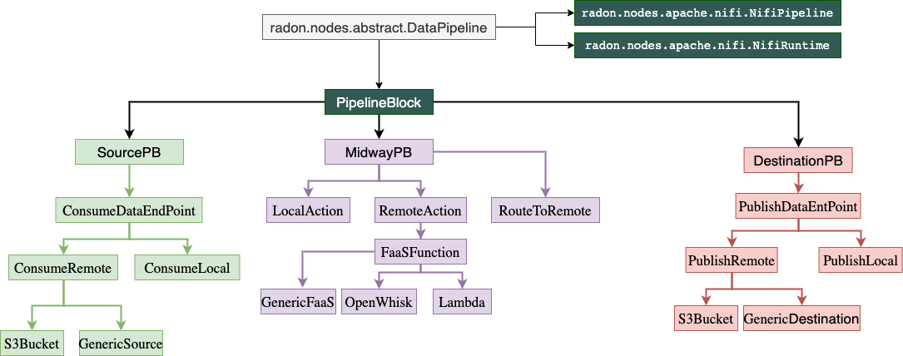
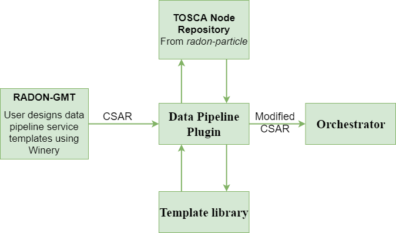

RADON Datapipeline Methodology
~~~~~~~~~~~~~~~~~~~~~~~~~~~~~~~

Following figures shows the basic concept of data pipeline. RADON data pipeline provides an environment to build serverless data intensive applications and handle the movement of data between different clouds in an efficient manner. In the process of data movement, RADON Data pipeline allows the users to apply analyticcal operations onto the data taking the help of serverless platform. Such applications can be designed using TOSCA language.
We see *PipelineBlock* as a basic building block of a TOSCA based data intensive appications. 

.. image:: images/BasicDPConcept.png

A *PipelineBlock* can be designed for different pipeline tasks, such as extracting data from a remote database, or from a AWS S3bucket, processing the data by invoking serverless function etc. In RADON data pipeline, the TOSCA pipelines nodes structured in a manner presented in following figure. 

This consortium will design and develop a set of necessary pipeline nodes that will be available in `radon  particles <https://github.com/radon-h2020/radon-particles>`_ repository. The service template deeloped using datapipeline nodes will then be forwarded to the data piepline plugin which will make sure that the user-designed service template is workablle and the pipelines can be deployed in the required cloud or local environment.

The above picture presents the interaction of data pipeline plugin with other RADON components. The plugin  pipeline can invoked through a command line interface or through REST-based interface. The pipeline plugin vwill be responsible for:
* Parsing and reversing the pipeine CSAR
* Attaching the necessary relationship templates in case of multi cloud pipeline deployment.
* Updating the node templates based on the targeted cloud environment.
* Ensuring the data encryption in multi-cloud service deployment

The plugin also contains a REST-based interface, using which users can execute the plugin on-demand or include it as a part of a CI/CD process. DataPipeline plugin is publicly available under the `Apache License 2.0 <http://www.apache.org/licenses/>`_ open-source license in GitHub: https://github.com/radon-h2020/radon-datapipeline-plugin 

The following video provides a 5-minute demo.

.. raw:: html

   <iframe width="560" height="315" src="https://www.youtube.com/embed/_6zTEj2ZJ54" frameborder="0" allow="accelerometer; autoplay; encrypted-media; gyroscope; picture-in-picture" allowfullscreen></iframe>
   
